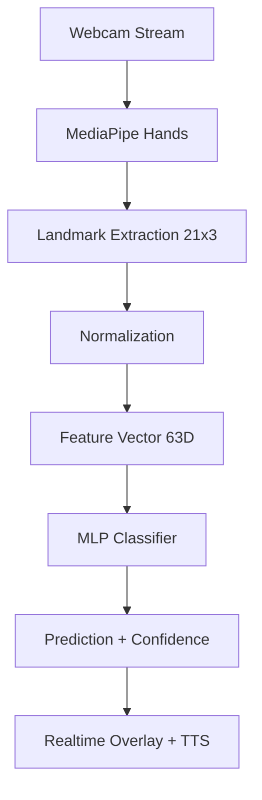
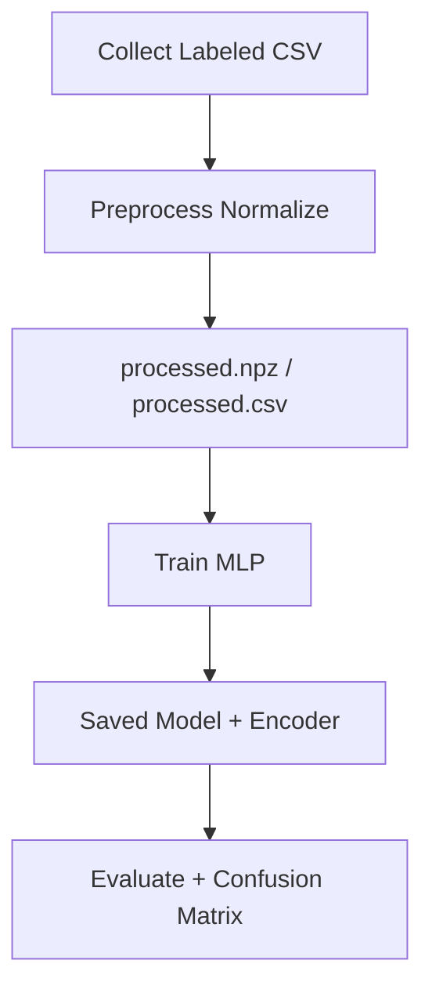

# Sign Language Translator (ASL Alphabet) — Full Technical Documentation

This document provides end‑to‑end documentation for the ASL hand‑gesture translator. It describes architecture, data flow, methods, training, evaluation, and real‑time inference, including the sentence‑level extension.

---

## 1) System Overview

The system translates **ASL alphabet hand gestures (A–Z)** captured from a live webcam into text (optional speech). It is modular and extensible for words and sentences.

Core stages:
1. **Data collection** using MediaPipe Hands (21 landmarks)
2. **Preprocessing** with translation/scale normalization
3. **Training** a TensorFlow MLP classifier
4. **Evaluation** with accuracy + confusion matrix
5. **Real‑time inference** with smoothing and overlays
6. **Sentence builder** (optional) to output phrases and full sentences

---

## 2) Repository Structure (Key Modules)

```
/ data_collection/collect_data.py
/ preprocessing/preprocess.py
/ training/model.py
/ training/train_model.py
/ training/evaluate.py
/ inference/predictor.py
/ realtime/realtime_translator.py
/ realtime/realtime_translator_sentences.py
/ utils/mediapipe_utils.py
/ utils/visualization.py
```

---

## 3) Data Collection

### Goal
Collect labeled landmark samples from webcam for ASL letters A–Z.

### Method
- **MediaPipe Hands** detects 21 key landmarks per hand.
- Each captured frame produces **21 × (x,y,z)** values + **handedness**.
- Labels assigned interactively by pressing the corresponding letter key.

### Output
CSV files saved to:
```
/data/raw/collection_YYYYMMDD_HHMMSS.csv
```
Each row:
```
label,handedness,lm0_x,lm0_y,lm0_z,...,lm20_x,lm20_y,lm20_z
```

### Notes
- The collector always saves **only the primary hand** (highest confidence).
- Supports left/right hand labeling automatically.

---

## 4) Preprocessing

### Goals
- Normalize landmarks to reduce variation from position and scale.
- Convert landmarks into fixed‑length feature vectors (63 floats).

### Normalization Method
Given landmarks **L ∈ R^{21×3}**:
1. **Handedness alignment**: if left hand, flip X axis
2. **Translation**: subtract wrist landmark (landmark 0)
3. **Scale**: divide by max landmark distance from wrist

Formula:
```
L' = (L - L_wrist) / max(||L_i - L_wrist||)
```

### Output
```
/data/processed/processed.npz  (X, y)
/data/processed/processed.csv  (label + features)
```

---

## 5) Model Architecture

### Network
A compact **MLP classifier**:
- Input: 63 features (21 landmarks × 3)
- Dense(256) → BN → Dropout
- Dense(128) → BN → Dropout
- Dense(64) → BN
- Dense(26) + Softmax

### Why MLP?
Landmark‑based gestures are **low‑dimensional** and already structured. An MLP is fast, stable, and high‑performing for this setting.

---

## 6) Training

### Steps
1. Load processed dataset
2. Encode labels (A–Z)
3. Train/validation/test split (stratified)
4. Train with early stopping + LR schedule
5. Save model + label encoder

### Outputs
```
/models/asl_mlp.keras
/models/label_encoder.pkl
/data/processed/splits.npz
```

---

## 7) Evaluation

### Metrics
- Accuracy
- Classification report (precision/recall/F1)
- Confusion matrix (CSV)

Outputs:
```
/data/processed/confusion_matrix.csv
```

---

## 8) Real‑Time Inference Pipeline

### Steps
1. Capture frame from webcam
2. Detect hand landmarks with MediaPipe
3. Normalize landmarks
4. Predict class probabilities
5. Smooth predictions with rolling window
6. Display prediction + confidence on frame
7. Optional TTS

### Smoothing
A rolling window averages probabilities to stabilize predictions:
```
P̄ = mean(P_t−k ... P_t)
```

---

## 9) Sentence Builder (New Feature)

File: `realtime/realtime_translator_sentences.py`

### Goal
Convert sequences of predicted letters into words and sentences using timing and stability rules.

### Core Logic
- **Stable frames** → commits a letter
- **Short pause** → inserts a space
- **Long pause** → inserts sentence terminator (. )

### Controls
- `T` toggle TTS
- `C` clear buffer
- `B` backspace
- `. , ! ?` manual punctuation

---

# Flowcharts

## A) Overall Pipeline



## B) Data Pipeline



## C) Real‑Time Sentence Builder

```mermaid
flowchart TD
    A[Frame Prediction] --> B{Hand Detected?}
    B -- Yes --> C[Stability Counter]
    C --> D{Stable & Confident?}
    D -- Yes --> E[Commit Letter]
    D -- No --> F[Wait]
    B -- No --> G[Pause Timer]
    G --> H{Pause > Space?}
    H -- Yes --> I[Insert Space]
    H -- No --> J[Wait]
    G --> K{Pause > Sentence?}
    K -- Yes --> L[Insert ". "]
```

---

## 10) Performance & Robustness Notes

- **No‑hand frames** reset the smoothing buffer to avoid ghost predictions.
- **Multiple hands**: only highest‑confidence hand is used.
- **Confidence threshold** avoids noisy predictions.
- **Rolling probability smoothing** increases stability at ~30 FPS.

---

## 11) Extending to Words and Sentences (Model Level)

To move beyond per‑frame letter classification:
1. Collect **temporal sequences** of landmarks.
2. Train a temporal model (LSTM/GRU/TCN).
3. Predict **word‑level or sentence‑level** units.

---

## 12) Troubleshooting

- **Empty raw files** cause preprocessing failures. Ensure CSVs have rows.
- **Low accuracy** often indicates poor lighting or imbalanced samples.
- **M1/M2 optimizer warnings** are known; inference runs fine with `compile=False`.

---

## 13) Execution Summary

```
python data_collection/collect_data.py
python preprocessing/preprocess.py
python training/train_model.py
python training/evaluate.py
python realtime/realtime_translator.py
python realtime/realtime_translator_sentences.py
```

---

## 14) Key Methods Recap

- **MediaPipe Hands** for 21 landmark detection
- **Normalization** for translation/scale invariance
- **MLP classifier** for fast landmark‑based gesture recognition
- **Smoothing window** to stabilize predictions
- **Sentence builder** for natural language output

